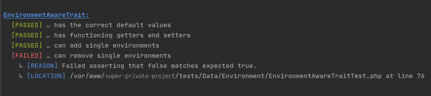

# beautify-specify

A simple wrapper to add some color and information to the phpunit/specify **bash** output.

## Output



## Installation

```shell-script
composer require --dev barthy-koeln/beautify-specify
```

## Usage

Add the following to your `phpunit.xml`:

```xml
<phpunit
  printerClass="BarthyKoeln\BeautifySpecify\ResultPrinter"
/>
```

Please note that currently the only task of this result printer is not printing any progress or failures.
The output is handled entirely in the Specify wrapper.

For each test case, replace any `Specify` trait with the trait provided by this library.
Then, use the Specify framework as always and as [described in the documentation](https://github.com/Codeception/Specify).

## Example:

```php
use BarthyKoeln\BeautifySpecify\Specify;
use PHPUnit\Framework\TestCase;

class SomeClassTest extends TestCase
{
    use Specify;

    public function testValidation()
    {
        $this->describe(
            'SomeClass',
            function () {
                $this->it(
                    'has the correct default values',
                    function () {
                        $this->assertEquals([3.14159,  2.71828], $this->someClass->getValues());
                    }
                );

                // […]

            }
        );
    }
}
```
